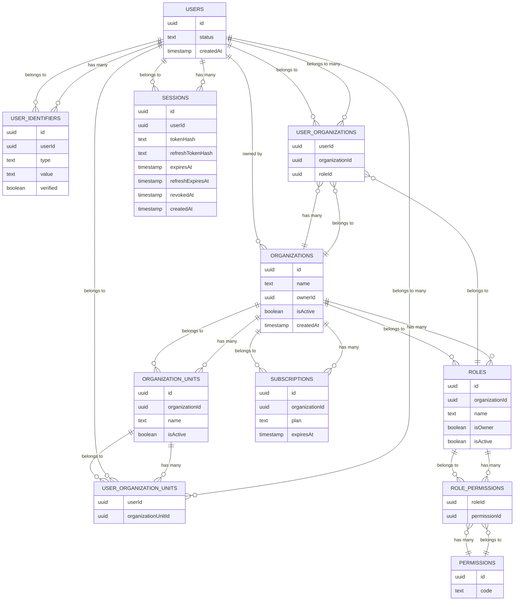

# Project Title

## Database Schema

## Scripts

- `npm run dev`: Start the development server (Next.js dev mode)
- `npm run build`: Build the application for production
- `npm run start`: Start the production server
- `npm run lint`: Run ESLint for code linting
- `npm run test`: Run all tests using Jest
- `npm run test:watch`: Run tests in watch mode
- `npm run test:client`: Run tests for client-side code
- `npm run test:server`: Run tests for server-side code
- `npm run test:shared`: Run tests for shared code
- `npm run test:coverage`: Run tests with coverage report
- `npm run db:generate`: Generate database migration files using Drizzle
- `npm run db:migrate`: Apply database migrations
- `npm run db:studio`: Open Drizzle Studio for database management
- `npm run db:seed`: Seed the database with initial data
- `npm run db:reset`: Reset the database and apply migrations